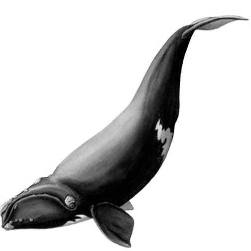

#  Maritime Whale

Maritime Whale monitors ship traffic in the ports of Charleston, North Carolina and Savannah, Georgia.

Monitoring and analysis made available at https://www.maritimewhale.com.

Documentation in the source is rooted in [docs/README.md](docs/README.md).

_For more help please contact [@riwhale](https://github.com/riwhale) at [dev.riwhale+help@gmail.com](mailto:dev.riwhale+help@gmail.com)._
